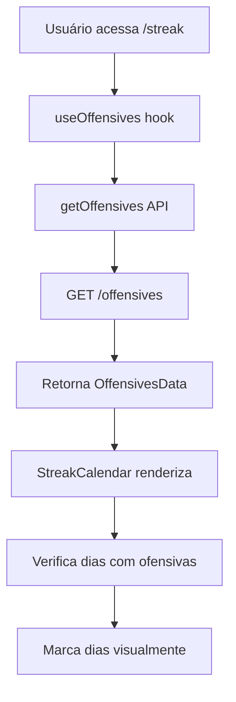

# Sistema de Ofensivas - Documentação

## 📋 Visão Geral

O sistema de ofensivas é uma funcionalidade que permite aos usuários acompanhar sua progressão de estudos através de um calendário visual que marca os dias em que o usuário completou atividades de estudo (ofensivas).

## 🎯 Funcionalidades Principais

### 1. **Calendário de Ofensivas**
- Exibe um calendário mensal com dias marcados
- Marca visualmente os dias com ofensivas (fundo laranja + ícone de chama)
- Permite navegação entre meses
- Mostra estatísticas de streak

### 2. **Clique Interativo**
- Usuário pode clicar em dias com ofensivas
- Ao clicar, faz uma nova requisição para o endpoint `/offensives`
- Atualiza os dados do calendário em tempo real

### 3. **Sistema de Streak**
- Acompanha dias consecutivos de estudo
- Calcula melhor streak
- Mostra ofensivas do mês atual

## 🏗️ Arquitetura do Sistema

### **Componentes Principais**

```
src/
├── components/
│   ├── StreakCalendar.tsx          # Calendário principal
│   └── OffensivesCard.tsx          # Card de estatísticas
├── hooks/
│   └── useOffensives.ts            # Hook para buscar dados
├── api/
│   └── offensives/
│       └── get-offensives.ts       # API de ofensivas
└── types/
    └── offensives.ts               # Tipos TypeScript
```

## 📊 Estrutura de Dados

### **Tipos TypeScript**

```typescript
export type OffensiveType = 'NORMAL' | 'SUPER' | 'ULTRA' | 'KING' | 'INFINITY';

export interface OffensiveHistory {
  date: string;           // Data no formato YYYY-MM-DD
  hasOffensive: boolean;  // Se tem ofensiva neste dia
  type: OffensiveType;    // Tipo da ofensiva
}

export interface CurrentOffensive {
  id: string;
  type: OffensiveType;
  consecutiveDays: number;        // Dias consecutivos
  lastVideoCompletedAt: string;   // Último vídeo completado
  streakStartDate: string;        // Data de início do streak
  totalOffensives: number;        // Total de ofensivas
}

export interface OffensiveStats {
  totalOffensives: number;        // Total de ofensivas
  currentStreak: number;          // Streak atual
  longestStreak: number;          // Melhor streak
  currentType: OffensiveType;     // Tipo atual
}

export interface NextMilestones {
  daysToSuper: number;            // Dias para Super
  daysToUltra: number;            // Dias para Ultra
  daysToKing: number;             // Dias para King
  daysToInfinity: number;         // Dias para Infinity
}

export interface OffensivesData {
  currentOffensive: CurrentOffensive;
  history: OffensiveHistory[];    // Histórico de dias
  stats: OffensiveStats;
  nextMilestones: NextMilestones;
}
```

## 🔄 Fluxo de Funcionamento

### **1. Carregamento Inicial**



### **2. Verificação de Dias com Ofensivas**

O sistema verifica apenas o histórico real de ofensivas:

#### **Verificação por History**
```typescript
if (offensivesData.history && offensivesData.history.length > 0) {
  // Usa apenas dados do histórico
  const hasOffensive = offensivesData.history.some(day =>
    day.date === dateStr && day.hasOffensive
  );
}
```

**Importante**: O calendário marca **apenas os dias em que o usuário realmente completou vídeos**, conforme registrado no histórico. Não há fallback automático - se um dia não está no histórico, ele não será marcado como tendo ofensiva.

### **3. Clique em Ofensiva**

```mermaid
graph TD
    A[Usuário clica em dia com ofensiva] --> B[handleOffensiveClick]
    B --> C[Valida se dia tem ofensiva]
    C --> D[Captura data clicada]
    D --> E[refetch() - Nova requisição]
    E --> F[GET /offensives]
    F --> G[Atualiza dados do calendário]
    G --> H[Re-renderiza calendário]
```

## 🎨 Interface Visual

### **Estados dos Dias**

| Estado | Aparência | Descrição |
|--------|-----------|-----------|
| **Dia Normal** | Fundo transparente, texto branco | Dia sem ofensiva |
| **Dia com Ofensiva** | Fundo laranja, texto laranja claro, ícone de chama | Dia com ofensiva |
| **Hover** | Fundo branco semi-transparente | Efeito ao passar mouse |

### **Cores e Tipos de Ofensiva**

```typescript
const getFlameColor = (type: OffensiveType) => {
  switch (type) {
    case 'NORMAL': return 'text-orange-400';
    case 'SUPER': return 'text-red-400';
    case 'ULTRA': return 'text-purple-400';
    case 'KING': return 'text-yellow-400';
    case 'INFINITY': return 'text-blue-400';
    default: return 'text-orange-400';
  }
};
```

## 🔧 Configurações e Cache

### **TanStack Query Configuration**

```typescript
export function useOffensives() {
  return useQuery({
    queryKey: ['offensives'],
    queryFn: async (): Promise<OffensivesData> => {
      const response = await getOffensives();
      return response.data;
    },
    enabled: true,
    staleTime: 5 * 60 * 1000,        // 5 minutos
    gcTime: 10 * 60 * 1000,          // 10 minutos
    refetchOnWindowFocus: false,      // Não refetch ao focar janela
    refetchOnMount: false,            // Não refetch ao montar
  });
}
```

### **Logs de Debug**

O sistema inclui logs detalhados para debug:

```typescript
// Logs principais
console.log('📅 StreakCalendar - offensivesData:', offensivesData);
console.log('📅 StreakCalendar - history:', offensivesData?.history?.length || 0, 'dias');
console.log('📅 StreakCalendar - currentOffensive:', offensivesData?.currentOffensive);

// Logs de verificação de dias
console.log(`🔍 StreakCalendar: Verificando ${dateStr}`);
console.log(`✅ StreakCalendar: ${dateStr} - Tem ofensiva: ${hasOffensive}`);

// Logs de clique
console.log('🔥 Clique na ofensiva do dia:', dateStr);
console.log('🔄 Refazendo requisição para /offensives...');
```

## 🚀 Como Usar

### **1. Acessar o Calendário**
```
Navegue para: /streak
```

### **2. Visualizar Ofensivas**
- Dias com fundo laranja = dias com ofensivas
- Ícone de chama = confirmação visual
- Estatísticas na parte inferior

### **3. Interagir com Ofensivas**
- Clique em qualquer dia com ofensiva
- Sistema fará nova requisição automaticamente
- Dados serão atualizados em tempo real

### **4. Navegar entre Meses**
- Use as setas `<` e `>` no cabeçalho
- Calendário atualiza automaticamente

## 🐛 Troubleshooting

### **Problemas Comuns**

#### **1. Dias não aparecem marcados**
```typescript
// Verificar logs no console:
// ❌ StreakCalendar: Sem dados de ofensivas
// ✅ StreakCalendar: History length: 0
// ✅ StreakCalendar: CurrentOffensive: {...}
```

**Solução**: Sistema usa `currentOffensive` como fallback quando `history` está vazio.

#### **2. Clique não funciona**
```typescript
// Verificar se dia tem ofensiva:
if (!day || !hasStreakOnDay(day)) return;
```

**Solução**: Só funciona em dias que realmente têm ofensivas.

#### **3. API não responde**
```typescript
// Verificar logs de requisição:
// 🌐 fetchJson: Fazendo requisição para https://...
// 🔑 fetchJson: Token presente: Sim/Não
```

**Solução**: Verificar autenticação e conectividade.

### **Logs de Debug**

Para ativar logs detalhados, verifique o console do navegador:

```javascript
// Logs esperados:
📅 StreakCalendar - offensivesData: {...}
📅 StreakCalendar - history: 0 dias
📅 StreakCalendar - currentOffensive: {...}
🔍 StreakCalendar: Verificando 2024-01-15
✅ StreakCalendar: 2024-01-15 - Tem ofensiva: true
🔥 Clique na ofensiva do dia: 2024-01-15
🔄 Refazendo requisição para /offensives...
✅ Requisição de ofensivas refeita com sucesso
```

## 📈 Melhorias Futuras

### **Funcionalidades Planejadas**
- [ ] Modal com detalhes da ofensiva
- [ ] Filtros por tipo de ofensiva
- [ ] Exportação de dados
- [ ] Notificações de streak
- [ ] Gamificação adicional

### **Otimizações**
- [ ] Lazy loading do calendário
- [ ] Cache mais inteligente
- [ ] Compressão de dados
- [ ] Offline support

## 🔗 Endpoints da API

### **GET /offensives**
```typescript
// Request
GET /offensives
Authorization: Bearer <token>

// Response
{
  "success": true,
  "data": {
    "currentOffensive": {...},
    "history": [...],
    "stats": {...},
    "nextMilestones": {...}
  }
}
```

## 📝 Notas de Desenvolvimento

### **Decisões Técnicas**
1. **Verificação por Histórico**: Usa apenas o `history` retornado pela API - marcando apenas dias com atividade real do usuário
2. **TanStack Query**: Para cache e gerenciamento de estado
3. **Logs Detalhados**: Para facilitar debug
4. **TypeScript**: Tipagem completa para segurança

### **Performance**
- Cache de 5 minutos para dados
- Não refetch desnecessário
- Renderização otimizada
- Logs condicionais

---

**Última atualização**: Janeiro 2025  
**Versão**: 1.0.0  
**Autor**: Sistema de Ofensivas
